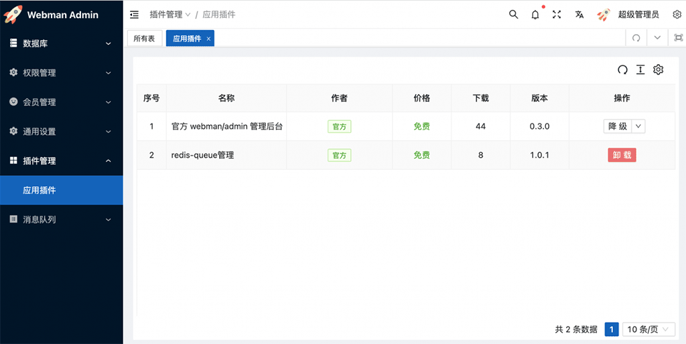

# webman/admin
`webman/admin` 是基于webman开发的一个管理后台，它实际上是一个webman应用插件，任何webman项目(*要求webman>=1.4*)都可以安装使用它。`webman/admin`将成为webman非常重要的生态。

# 前端技术栈
前端使用[ven-vben-admin](https://github.com/vbenjs/vue-vben-admin) ，也就是[ant.design](https://ant.design/index-cn) + [vue3](https://cn.vuejs.org/)。

# webman/admin 目标
### 为应用插件提供统一的后台
应用插件作为webman的一个重要生态，需要有一个统一的admin后台，所有应用插件可以接入这个后台，实现各个应用插件功能统一在一个后台管理

### 提供统一的应用插件管理入口
`webman/admin` 提供一个应用插件市场，方便应用插件检索、安装、更新及卸载。让开发者像搭建积木一样搭建自己的应用。

### 统一用户体系
`webman/admin` 提供一个用户表，各个应用插件基于此表开发应用插件，用户数据会自然打通，实现应用插件之间的互通。

### 减少重复的开发工作
`webman/admin` 提供通用的功能，如数据库管理、一键菜单、权限管理、用户管理等，使用`webman/admin`开发者无需重复开发这些模块，便可以快速拥有一个简单的管理后台

# 预览
