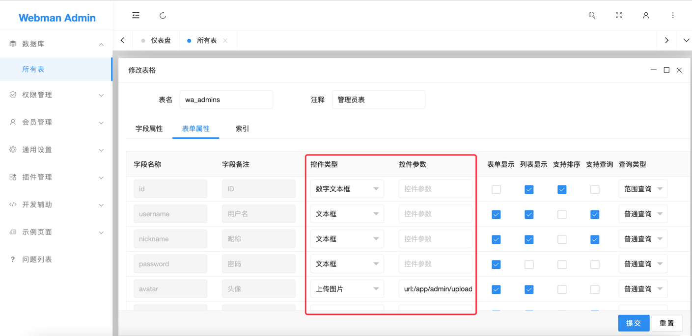

# 控件及参数

为了方便向表中插入记录，插入表单支持设置控件类型及参数。本节将讲述表单支持哪些控件及参数。

# 控件参数格式
选项与值之间以冒号`:`分割，多个控件参数之间以分号`;`分割。
例如上传控件参数可能为 `url:/app/admin/common/upload/file;maxCount:1`

# 控件类型及参数

### 文本框/数字文本框 input
|参数|说明|类型|默认值|
|---|----|-----|----|
|lay-verify|验证类型 required (必填项) phone（手机号）email（邮箱）url（网址）number（数字）date（日期）identity(身份证)| string | |
|placeholder| placeholder 占位符| string | |
|disabled|只读|int | 0|
|autocomplete|是否自动完成表单|int |1|
|type|input类型 number 或 text|string |text|

### 多行文本 textArea
|参数|说明|类型|默认值|
|---|----|-----|----|
|lay-verify|验证类型 required (必填项) phone（手机号）email（邮箱）url（网址）number（数字）date（日期）identity(身份证)| string | |
|placeholder| placeholder 占位符| string | |
|disabled|只读|int | 0|

### 下拉单选/下拉多选 Select
|参数|说明|类型|默认值|
|---|----|-----|----|
|url|获取opitnons数据的地址| string | |
|data|options数据 示例data:0:成功,1:失败| string | |

**如果下拉选择是静态的**
则填写格式类似为 `data:0:正常,1:禁用,2:审核`

**如果下拉选择是动态的**
则填写格式为url `url:/app/admin/admin/select?format=select`
url返回格式参考 `plugin/admin/app/controller/Crud.php` `formatSelect` 方法

### 日期选择/日期时间选择 datePicker

|参数|说明|类型|默认值|
|---|----|-----|----|
|lay-verify|验证类型 required (必填项) | string | |
|type|选择器类型可选值有 year month date time datetime | string | |
| format |日期格式可选值有yyyy  y MM M dd d HH H mm m ss s| string | |
| value |默认值 如2018-08-20 20:08:08| string | |
| weekStart |0周日 1周一|int | |
| min |最小值 如2017-1-1| string | |
| max |最大值 如 2017-12-31| string | |
| position | 定位方式 absolute  fixed  static | string | |
| zIndex |层叠顺序| int | |
| showBottom |是否显示底部栏| int | 1|
| calendar |是否显示公历节日| int |0 |

### 开关 Switch
| 参数       |说明|类型|默认值|
|----------|----|-----|----|
| disabled |只读|int | 0|
| value    |初始值 0或1|int | 0|
| lay-text |定义开关两种状态的文本示例`lay-text:开启|关闭`|string | |

### 上传文件 upload

|参数|说明|类型|默认值|
|----|----|-------|----|
| url |上传接口|string|`/app/admin/upload/file`|
|accept|指定允许上传时校验的文件类型，可选值有 images(图片) file(所有文件) video(视频) audio(音频)|string| |
| acceptMime |MIME 类型列表 如`image/*`(只显示图片文件) `image/jpg, image/png`(只显示 jpg 和 png 文件)|string| |
| exts |允许上传的文件后缀 如`zip|rar|7z`|string| |
| field |设定文件域的字段名|string|__file__|
| size |设置文件最大可允许上传的大小，单位 KB|int| |
| multiple |是否允许多文件上传|int|0|

### 上传图片 uploadImage
|参数|说明|类型|默认值|
|----|----|-------|----|
| url |上传接口|string|`/app/admin/upload/image`|
| exts |允许上传的文件后缀 如`zip|rar|7z`|string| |
| field |设定文件域的字段名|string|__file__|
| size |设置文件最大可允许上传的大小，单位 KB|int| |
| multiple |是否允许多文件上传|int|0|

### 图标 iconPicker

无参数

### 树形单选/树形多选 treeSelect/treeSelectMulti

|参数|说明|类型|默认值|
|----|----|------|----|
|url|返回树形结构的接口地址，格式参考表格底部说明|string| |

例如 `url:/app/admin/rule/select?format=tree`
返回格式参考 `plugin/admin/app/controller/Crud.php` `formatTree` 方法
