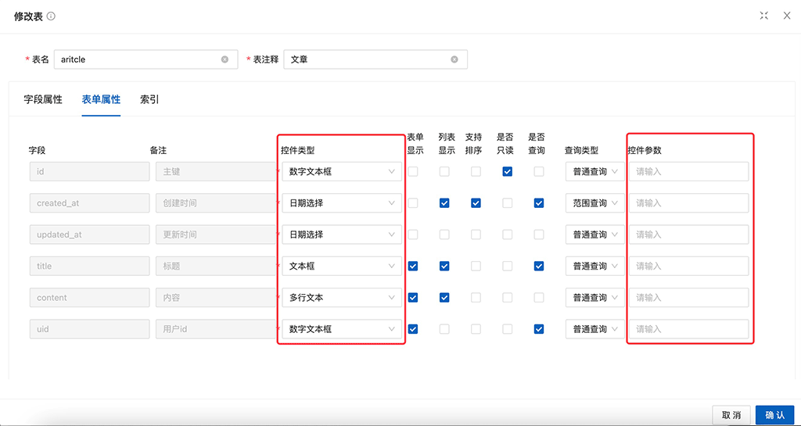

# 控件及参数

为了方便向表中插入记录，插入表单支持设置控件类型及参数。本节将讲述表单支持哪些控件及参数。

# 控件参数格式
选项与值之间以冒号`:`分割，多个控件参数之间以分号`;`分割。
例如上传控件参数可能为 `url:/app/admin/common/upload/file;maxCount:1`

# 控件类型及参数

### 文本框 Input
|参数|说明|类型|默认值|
|---|----|-----|----|
|addonAfter|带标签的 input，设置后置标签| string | |
|addonBefore|带标签的 input，设置前置标签| string | |
|allowClear|可以点击清除图标删除内容| boolean | |
|bordered|是否有边框| boolean |true|
|defaultValue|输入框默认内容| string | |
|disabled|是否禁用状态，默认为 false| boolean |false|
|id|输入框的 id| string | |
|maxlength|最大长度| number | |
|prefix|带有前缀图标的 input| string| |
|showCount|是否展示字数| boolean |false|
|size|控件大小。注：标准表单内的输入框大小限制为 large。可选 large default small| string |default|
|suffix|带有后缀图标的 input| string | |
|type|声明 input 类型，同原生 input 标签的 type 属性，见：MDN(请直接使用 <a-textarea /> 代替 type="textarea")。| string |text|
|value(v-model)|输入框内容|string| |

### 多行文本 TextArea
|参数|说明|类型|默认值|
|---|---|----|----|
|allowClear| 可以点击清除图标删除内容 |boolean| |
|autosize| 自适应内容高度，可设置为 true/false|boolean|false|
|defaultValue| 输入框默认内容 |string| |
|showCount| 是否展示字数 |boolean|false|
|value(v-model)| 输入框内容 |string| |

### 下拉选择 Select
|参数|说明|类型|默认值|
|----|----|---|----|
|allowClear|支持清除|boolean|false|
|autoClearSearchValue|是否在选中项后清空搜索框，只在 mode 为 multiple 或 tags 时有效。|boolean|true|
|autofocus|默认获取焦点|boolean|false|
|bordered|是否有边框|boolean|true|
|defaultActiveFirstOption|是否默认高亮第一个选项。|boolean|true|
|defaultOpen|是否默认展开下拉菜单|boolean|-|
|disabled|是否禁用|boolean|false|
|dropdownClassName|下拉菜单的 className 属性|string|-|
|dropdownMatchSelectWidth|下拉菜单和选择器同宽。默认将设置 min-width，当值小于选择框宽度时会被忽略。false 时会关闭虚拟滚动|boolean number|true|
|firstActiveValue|默认高亮的选项|string|-|
|listHeight|设置弹窗滚动高度|number|256|
|maxTagCount|最多显示多少个 tag|number|-|
|maxTagTextLength|最大显示的 tag 文本长度|number|-|
|mode|设置 Select 的模式为多选或标签|'multiple' 'tags' 'combobox'|-|
|notFoundContent|当下拉列表为空时显示的内容|string|'Not Found'|
|open|是否展开下拉菜单|boolean|-|
|options|options |例如 0:未通过,1:通过| |
|placeholder|选择框默认文字|string|-|
|searchValue|控制搜索文本|string|-|
|showArrow|是否显示下拉小箭头|boolean|true|
|showSearch|使单选模式可搜索|boolean|false|
|size|选择框大小，可选 large small|string|default|
|virtual|设置 false 时关闭虚拟滚动|boolean|true|

**如果下拉选择是静态的**
则填写格式类似为 options:0:正常,1:禁用,2:审核

**如果下拉选择是动态的**
则填写格式为url url:/app/admin/auth/admin/select?format=select
url返回格式参考 `plugin/admin/app/controller/Crud.php` `formatSelect` 方法

### 数字文本框 InputNumber

|参数|说明|类型|默认值|
|----|----|----|----|
|addonAfter|带标签的 input，设置后置标签|string|-|
|addonBefore|带标签的 input，设置前置标签|string|-|
|autofocus|自动获取焦点|boolean|false|
|bordered|是否有边框|boolean|true|
|controls|是否显示增减按钮|boolean|true|
|decimalSeparator|小数点|string|-|
|defaultValue|初始值|number| |
|disabled|禁用|boolean|false|
|keyboard|是否启用键盘快捷行为|boolean|true|
|max|最大值|number|Infinity|
|min|最小值|number|-Infinity|
|precision|数值精度|number|-|
|size|输入框大小|string|无|
|step|每次改变步数，可以为小数|number string|1|
|stringMode|字符值模式，开启后支持高精度小数。同时 change 事件将返回 string 类型|boolean|false|
|value(v-model)|当前值|number| |

### 日期选择 DatePicker

|参数|说明|类型|默认值|
|----|----|------|----|
|allowClear|是否显示清除按钮|boolean|true|
|autofocus|自动获取焦点|boolean|false|
|bordered|是否有边框|boolean|true|
|disabled|禁用|boolean|false|
|dropdownClassName|额外的弹出日历 className|string|-|
|inputReadOnly|设置输入框为只读（避免在移动设备上打开虚拟键盘）|boolean|false|
|mode|日期面板的状态|time date month year decade|-|
|open|控制弹层是否展开|boolean|-|
|picker|设置选择器类型|date week month quarter year date quarter|-|
|placeholder|输入框提示文字|string|-|
|size|输入框大小，large 高度为 40px，small 为 24px，默认是 32px|large middle small|-|
|valueFormat|可选，绑定值的格式，对 value、defaultValue、defaultPickerValue 起作用。不指定则绑定值为 dayjs 对象|string，具体格式|-|

### 时间选择 TimePicker

|参数|说明|类型|默认值|
|----|----|------|----|
|allowClear|是否展示清除按钮|boolean|true|
|autofocus|自动获取焦点|boolean|false|
|bordered|是否有边框|boolean|true|
|clearText|清除按钮的提示文案|string|clear|
|disabled|禁用全部操作|boolean|false|
|format|展示的时间格式|string|HH:mm:ss|
|hideDisabledOptions|隐藏禁止选择的选项|boolean|false|
|hourStep|小时选项间隔|number|1|
|inputReadOnly|设置输入框为只读（避免在移动设备上打开虚拟键盘）|boolean|false|
|minuteStep|分钟选项间隔|number|1|
|open(v-model)|面板是否打开|boolean|false|
|placeholder|没有值的时候显示的内容|string|请选择时间|
|popupClassName|弹出层类名|string|-|
|secondStep|秒选项间隔|number|1|
|showNow|面板是否显示“此刻”按钮|boolean|-|
|use12Hours|使用 12 小时制，为 true 时 format 默认为 h:mm:ss a|boolean|false|
|value(v-model)|当前时间|dayjs|-|
|valueFormat|可选，绑定值的格式，对 value、defaultValue 起作用。不指定则绑定值为 dayjs 对象|string，具体格式|-|

### 开关 Switch

|参数|说明|类型|默认值|
|----|----|-----|----|
|autofocus|组件自动获取焦点|boolean|false|
|checked(v-model)|指定当前是否选中|checkedValue unCheckedValue|false|
|checkedChildren|选中时的内容|string| |
|checkedValue|选中时的值|boolean string number|true|
|disabled|是否禁用|boolean|false|
|loading|加载中的开关|boolean|false|
|size|开关大小，可选值：default small|string|default|
|unCheckedChildren|非选中时的内容|string| |
|unCheckedValue|非选中时的值|boolean string number|false|

### 上传 Upload

|参数|说明|类型|默认值|
|----|----|-------|----|
|accept|接受上传的文件类型, 详见 input accept Attribute|string|无|
|upload|上传的地址|string|无|
|directory|支持上传文件夹（caniuse）|boolean|false|
|disabled|是否禁用|boolean|false|
|listType|上传列表的内建样式，支持三种基本样式 text, picture 和 picture-card|string|text|
|maxCount|限制上传数量。当为 1 时，始终用最新上传的文件代替当前文件|number|-|
|method|上传请求的 http method|string|post|
|multiple|是否支持多选文件，ie10+ 支持。开启后按住 ctrl 可选择多个文件。|boolean|false|
|name|发到后台的文件参数名|string|file|
|openFileDialogOnClick|点击打开文件对话框|boolean|true|
|openFileDialogOnClick|点击打开文件对话框|boolean|true|
|supportServerRender|服务端渲染时需要打开这个|boolean|false|
|withCredentials|上传请求时是否携带 cookie|boolean|false|

### 图标 IconPicker

|参数|说明|类型|默认值|
|----|----|-------|----|
|rotate|图标旋转角度（IE9 无效）|number|-|
|spin|是否有旋转动画|boolean|false|
|twoToneColor|仅适用双色图标。设置双色图标的主要颜色|string (十六进制颜色)|-|

### 树形选择 ApiTreeSelect

|参数|说明|类型|默认值|
|----|----|------|----|
|url|返回树形结构的接口地址，格式参考表格底部说明|string| |
|allowClear|显示清除按钮|boolean|false|
|defaultValue|指定默认选中的条目|string|
|disabled|是否禁用|boolean|false|
|dropdownClassName|下拉菜单的 className 属性|string|-|
|dropdownMatchSelectWidth|下拉菜单和选择器同宽。默认将设置 min-width，当值小于选择框宽度时会被忽略。false 时会关闭虚拟滚动|boolean number|true|
|labelInValue|是否把每个选项的 label 包装到 value 中，会把 value 类型从 string 变为 {value: string, label: VNode, halfChecked(treeCheckStrictly 时有效): string[] } 的格式|boolean|false|
|listHeight|设置弹窗滚动高度|number|256|
|maxTagCount|最多显示多少个 tag|number|-|
|multiple|支持多选（当设置 treeCheckable 时自动变为 true）|boolean|false|
|notFoundContent|当下拉列表为空时显示的内容|string|Not Found|
|placeholder|选择框默认文字|string|-|
|searchPlaceholder|搜索框默认文字|string|-|
|searchValue(v-model)|搜索框的值，可以通过 search 事件获取用户输入|string|-|
|showCheckedStrategy|定义选中项回填的方式。TreeSelect.SHOW_ALL: 显示所有选中节点(包括父节点). TreeSelect.SHOW_PARENT: 只显示父节点(当父节点下所有子节点都选中时). 默认只显示子节点.|enum{TreeSelect.SHOW_ALL, TreeSelect.SHOW_PARENT, TreeSelect.SHOW_CHILD }|TreeSelect.SHOW_CHILD|
|showSearch|在下拉中显示搜索框(仅在单选模式下生效)|boolean|false|
|size|选择框大小，可选 large small|string|'default'|
|title|自定义标题|string| |
|treeCheckable|显示 checkbox|boolean|false|
|treeCheckStrictly|checkable 状态下节点选择完全受控（父子节点选中状态不再关联），会使得 labelInValue 强制为 true|boolean|false|
|treeDataSimpleMode|使用简单格式的 treeData，具体设置参考可设置的类型 (此时 treeData 应变为这样的数据结构: [{id:1, pId:0, value:'1', label:"test1",...},...], pId 是父节点的 id)|false Array<{ id: string, pId: string, rootPId: null }>|false|
|treeDefaultExpandAll|默认展开所有树节点|boolean|false|
|treeIcon|是否展示 TreeNode title 前的图标，没有默认样式，如设置为 true，需要自行定义图标相关样式|boolean|false|
|treeLine|是否展示线条样式，请参考 Tree - showLine|boolean|false|
|treeNodeFilterProp|输入项过滤对应的 treeNode 属性|string|'value'|
|treeNodeLabelProp|作为显示的 prop 设置|string|'title'|
|value(v-model)|指定当前选中的条目|string|-|
|virtual|设置 false 时关闭虚拟滚动|boolean|true|

例如 url:/app/admin/auth/menu/select?format=tree
返回格式参考 `plugin/admin/app/controller/Crud.php` `formatTree` 方法

### 树 ApiTree

|参数|说明| 类型    |默认值|
|----|----|-------|----|
|url|返回树形结构的接口地址，格式参考表格底部说明|string| |
|autoExpandParent|是否自动展开父节点|boolean|false|
|blockNode|是否节点占据一行|boolean|false|
|checkable|节点前添加 Checkbox 复选框|boolean|false|
|checkStrictly|checkable 状态下节点选择完全受控（父子节点选中状态不再关联）|boolean|false|
|defaultExpandAll|默认展开所有树节点, 如果是异步数据，需要在数据返回后再实例化，建议用 v-if="data.length"；当有 expandedKeys 时，defaultExpandAll 将失效|boolean|false|
|disabled|将树禁用|bool|false|
|draggable|设置节点可拖拽|boolean|false|
|multiple|支持点选多个节点（节点本身）|boolean|false|
|selectable|是否可选中|boolean|true|
|showIcon|是否展示 TreeNode title 前的图标，没有默认样式，如设置为 true，需要自行定义图标相关样式|boolean|false|
|showLine|是否展示连接线|boolean|false|
|title|自定义标题|string| |
|virtual|设置 false 时关闭虚拟滚动|boolean|true|

例如 url:/app/admin/auth/menu/select?format=tree
返回格式参考 `plugin/admin/app/controller/Crud.php` `formatTree` 方法

> **提示**
> ApiTreeSelect 和 ApiTree 在样式和交互上有一定区别