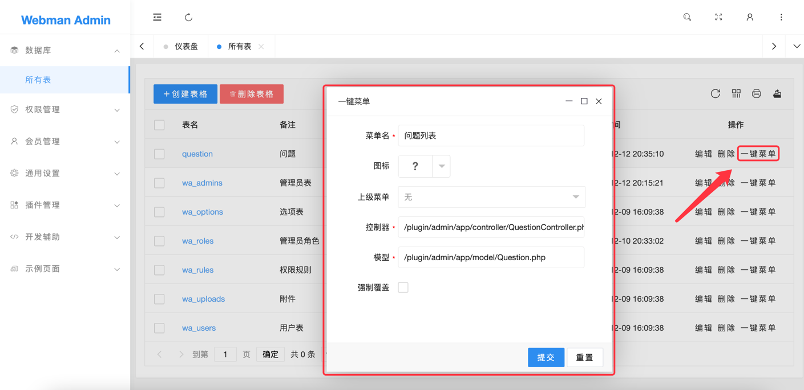
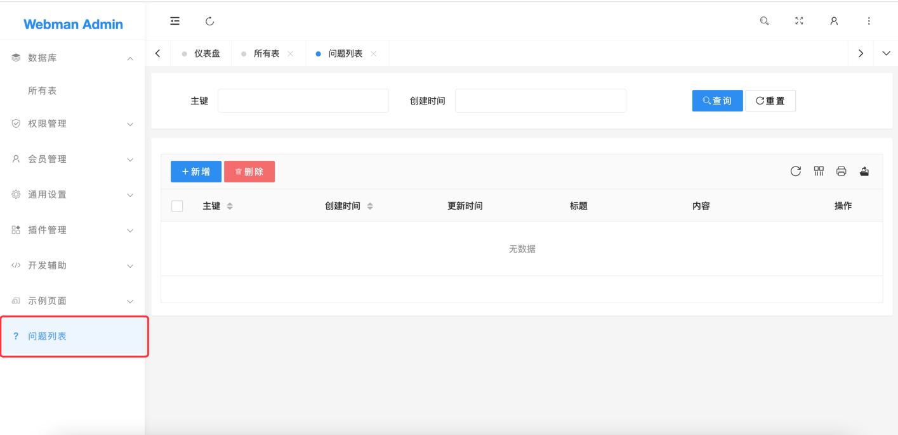
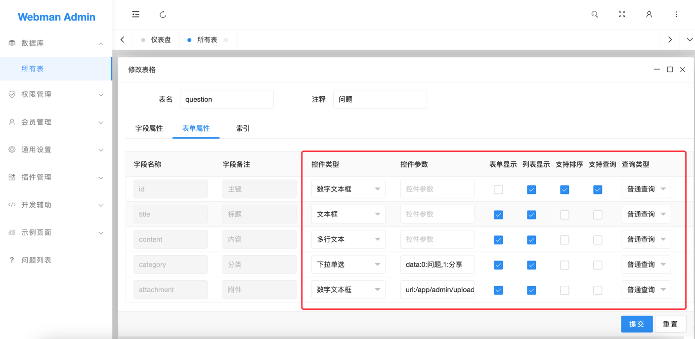

# 一键菜单




# 说明
支持手动指定控制器、模型的类名及位置。
可将位置指定到主项目，例如控制器位置指定为`/app/admin/controller/QuestionController.php`，
模型指定为`/app/admin/model/Question.php`则会在主项目生成如下的文件结构
```
app/admin/
├── controller
│   └── QuestionController.php
├── model
│   └── Question.php
└── view
    └── question
        ├── index.html
        ├── insert.html
        └── update.html
```

> **提示**
> 在一键菜单之前，请预先在表格编辑->表单属性里设置好各个字段的控件及参数，这样在生代码时，可以将控件参数一同生成，避免再次开发。表单属性编辑如下图



# 特别注意
**默认情况下，一键菜单在主项目生成的文件没有鉴权，这意味着任何人都可以对这些文件发起访问，原因是由于项目与应用插件的配置是隔离的，应用插件配置的鉴权中间件不会对主项目产生作用。**

为了避免非法访问，需要在主项目里配置鉴权中间件。为了让鉴权中间件不影响整个主项目，一键菜单生成的代码应该生成到一个特性应用下，例如`{主项目}/app/admin/`下，则`{主项目}/config/middleware.php`里的配置应该如下
```php
<?php
return [
    // 本地admin应用使用统一的webman/admin管理后台鉴权
    'admin' => [
        plugin\admin\api\Middleware::class
    ],
];
```

将代码生成到主项目下的一个好处就是与`webman/admin`解耦，自己admin相关的业务代码不会与`webman/admin`的代码参杂在一起，做版本控制代码迁移以及`webman/admin`升级都很方便。