# 数据库管理
`webman/admin` 自带一个数据库管理，类似小型的phpmyadmin系统。提供表的浏览、创建、更改、删除，以及记录的浏览、添加、更新、删除等功能。

# 创建表格
#### 点击创建表格
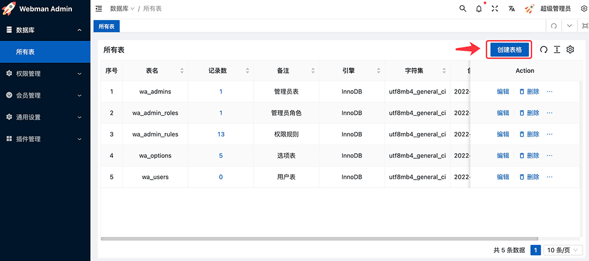

#### 设置字段等信息
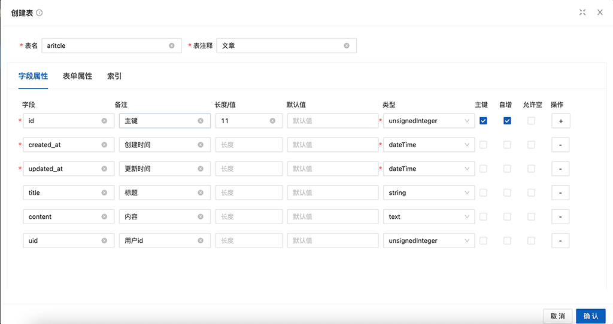

#### 设置表单信息
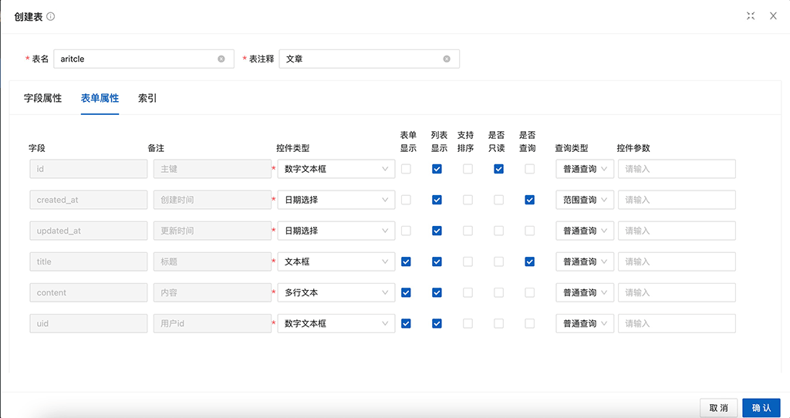

#### 设置索引
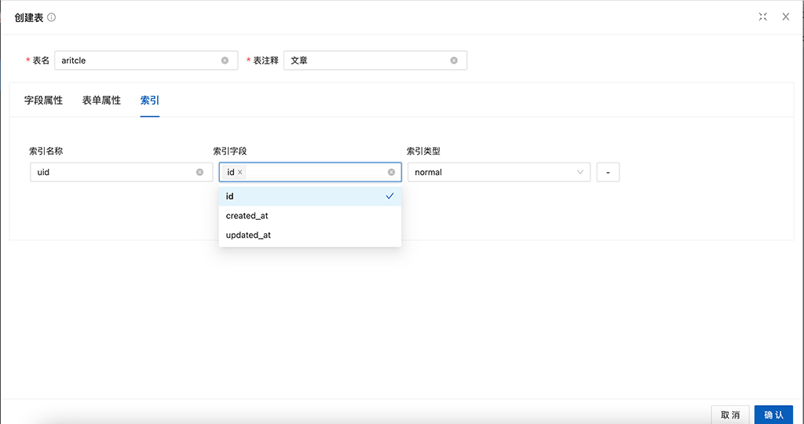

# 浏览表格
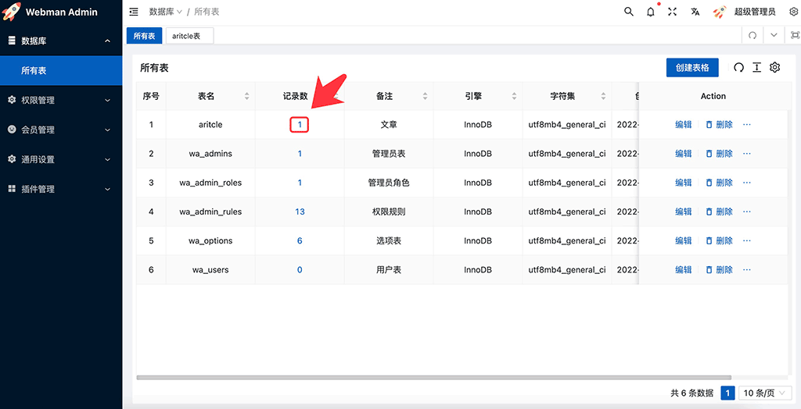

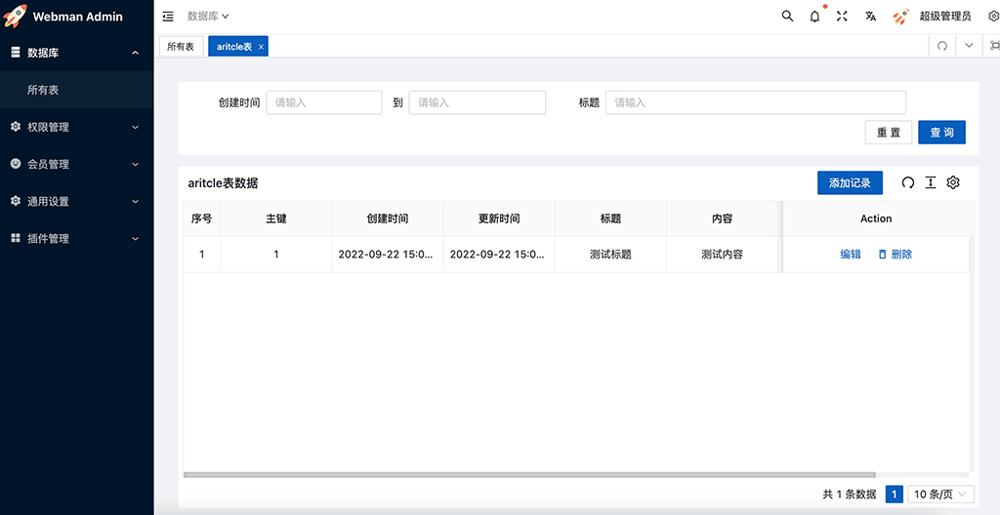

# 更改表格
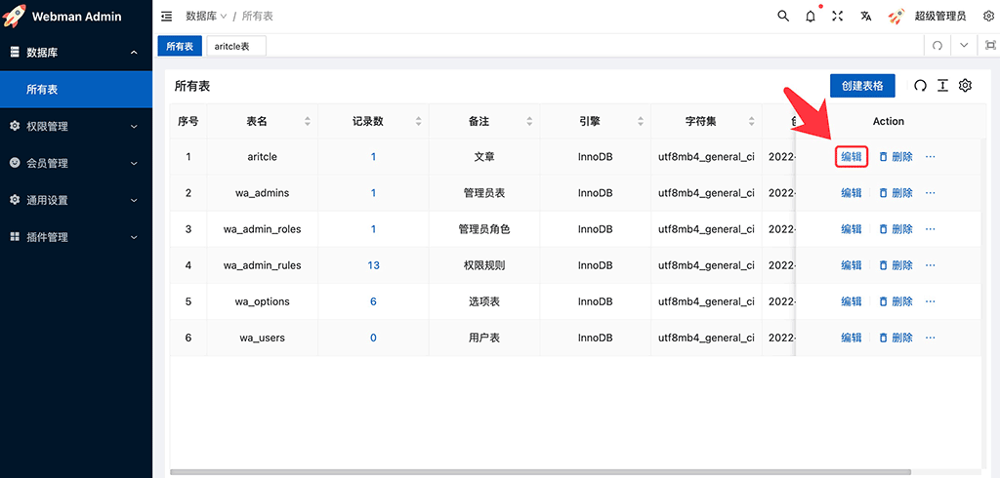

点击后显示的界面和创建表格页面相同

# 显示列
#### 临时设置显示哪些列
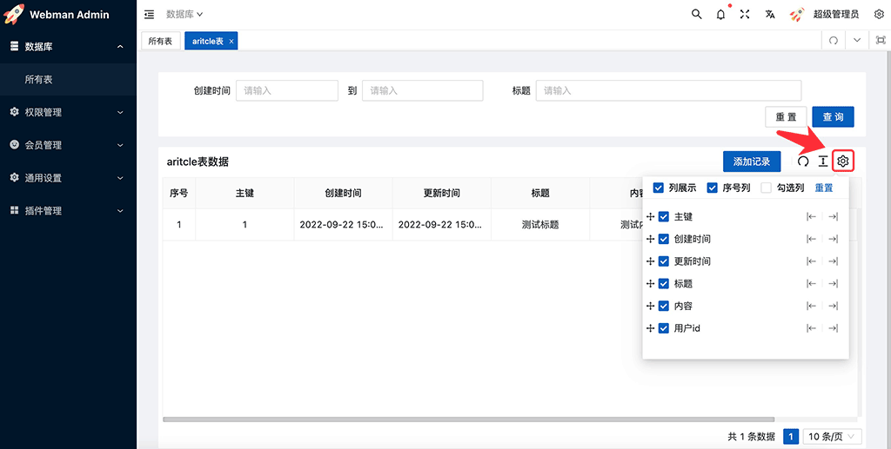

#### 永久性设置显示哪些列
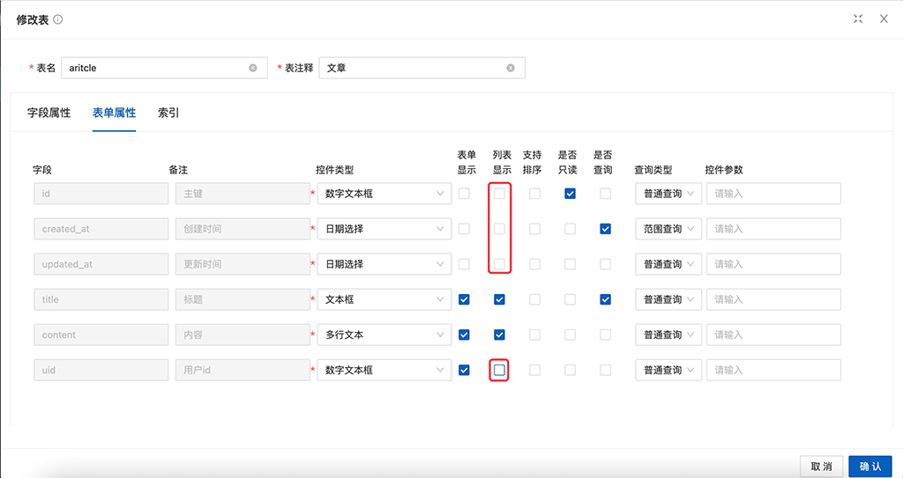

如上图确认后列表将只显示title和content两列内容。

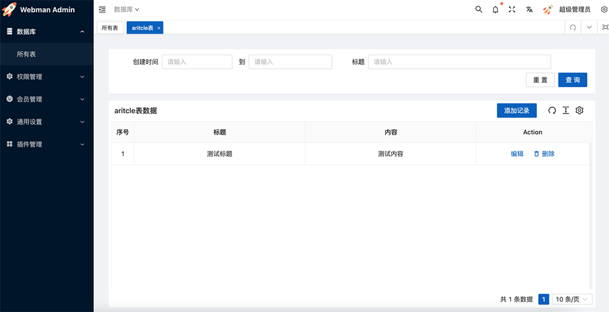

# 添加记录
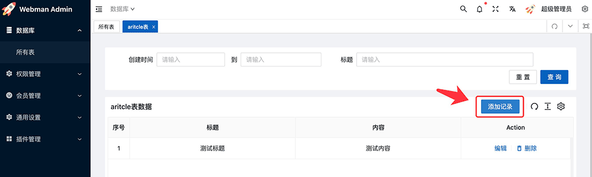
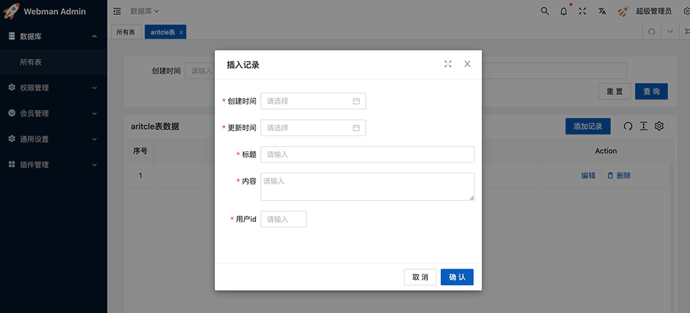

#### 设置表单字段

有时候有些字段有默认值不需要我们在表单中填写，例如创建时间和更新时间是系统自动填写的，这时候我们需要再次到表编辑页面的"表单属性"一栏中设置

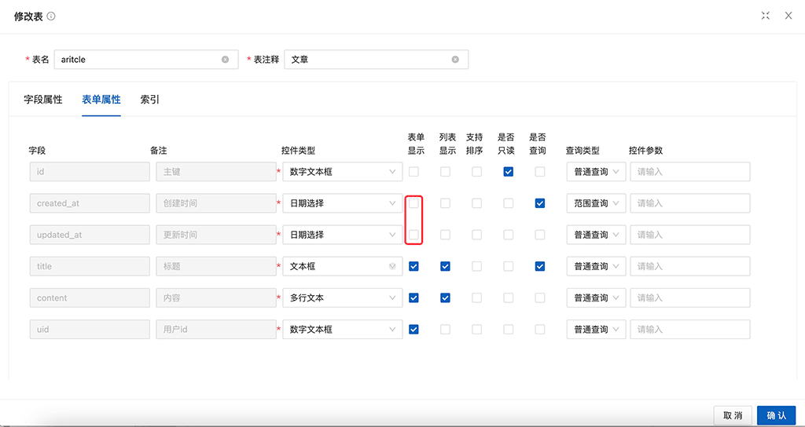

在表单显示一栏将创建时间和更新时间勾选掉，点击确定，此时再添加数据时表单显示如下

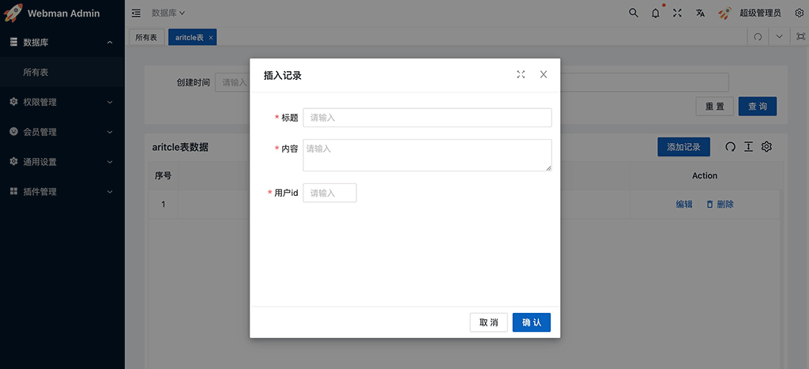

同时我们可以为表单的某个字段设置控件及控件参数，支持的控件及参数参考[控件](control.md)

# 列表排序
有时候我们希望列表能够按照某个字段排序，例如文章支持按照创建时间排序，我们只需要在表格的表单属性里设置支持排序字段即可，例如

如上图保存后文章列表将支持按照创建时间排序

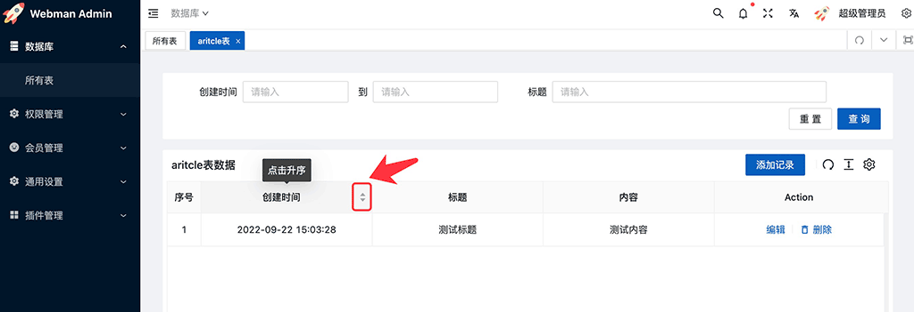

# 列表搜索
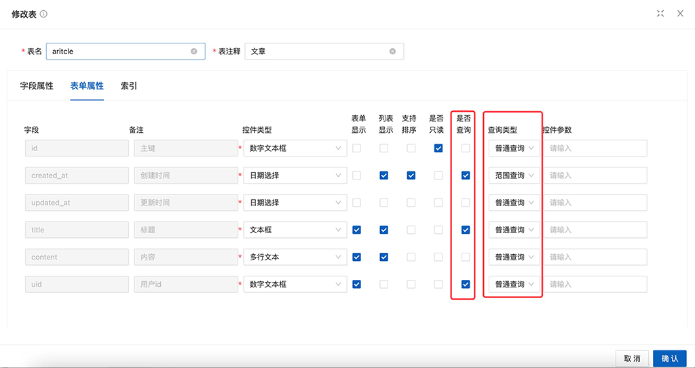

同样在表编辑页面的"表单属性"中可以设置某些字段是否支持查询，如上图所示，点击确定后列表页将显示创建时间、标题、用户id的搜框，如下图所示

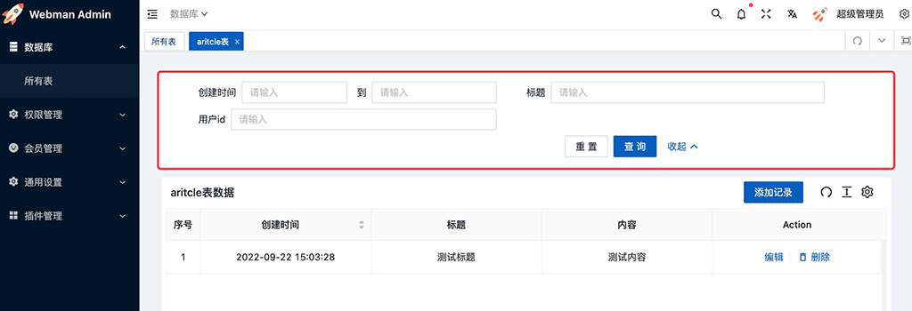
