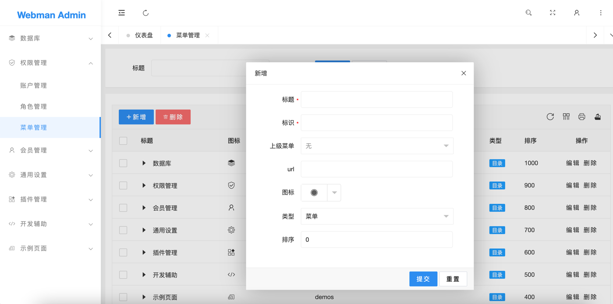

# 菜单管理

# 字段含义

#### 标题
也就是显示在菜单栏的名字

#### 标识
标识，**必须全局唯一。**
当类型是目录时，可填写目录对应的英文名，例如数据库目录标识为`database`。
当类型是菜单时，一般填写菜单对应控制器的类名，例如`plugin\admin\app\controller\TableController`
当类型是权限时，填写`控制器@方法`，例如`plugin\admin\app\controller\TableController@create`

> **提示**
> 权限类型一般不需要手动填写，在给角色设置权限时会自动扫描并填充

#### 上级菜单
选择上级菜单

#### url
页面url地址，例如 `/app/admin/table/index`

> **提示**
> 只有菜单类型需要填写，目录及权限类型不需要填写
> 
#### 图标
显示在菜单前的图标
 
#### 类型
分为目录、菜单、权限，其中权限是指是否有某个控制器的某个方法的执行权限

#### 排序
数字越大，位置也靠前