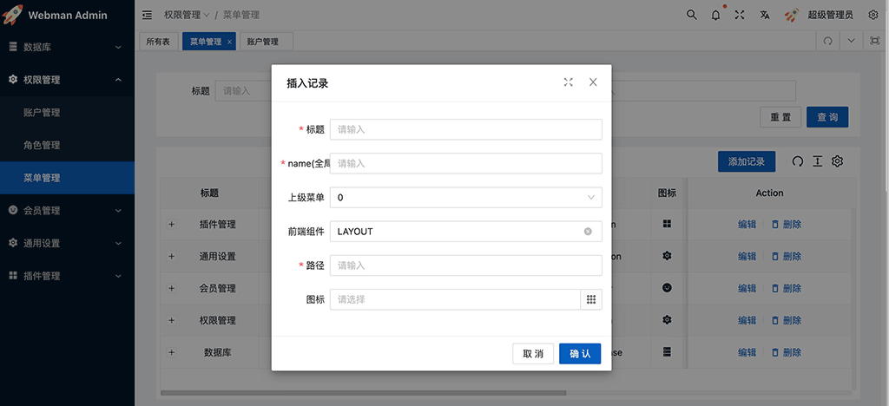

# 菜单管理

# 字段含义

#### 标题
也就是显示在菜单栏的名字

#### name(全局唯一)
name字段，**必须全局唯一。**
如果菜不是目录(也就是叶子节点)，name通常是控制器的类名，例如`plugin\admin\app\controller\user\UserController`。如果是目录，则填写合适的目录名，目录名不要以`app-`开头。

#### 上级菜单
下拉列表，选择上级菜单，如果没有上级菜单，留空或0即可。

#### 前端组件
如果菜单是目录或iframe，则填写`LAYOUT`。
如果菜单是具体的页面，则填写前端 [admin-vue-src](https://github.com/webman-php/admin-vue-src) 内部页面地址(忽略`src/views`前缀和文件后缀，例如页面`src/views/user/user/index.vue`的值为`/user/user/index`)，发布时需要重新编译，具体参考[添加页面](../development/page.md)

#### 路径
地址栏里显示的路径。
例如菜单"通用设置"路径的值为`/common`，该菜单下的"个人资料"菜单的路径为`account`，当用户访问"通用设置"下的"个人资料"时，地址栏里显示的路径为`/common/account`

#### 图标
显示在菜单前的图标

#### url
当菜单是一个iframe页面时，填写iframe的url地址，否则留空

#### 隐藏菜单
是否将菜单隐藏