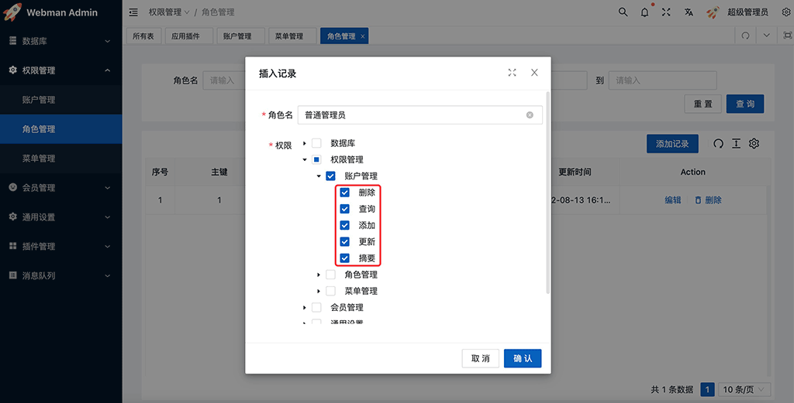

# 鉴权

`webman/admin` 目前只支持管理员鉴权。

## 原理

每个叶子节点的菜单一般都绑定一个控制器类名(name字段指定)，例如"权限管理"下的"账户管理"菜单name字段为`plugin\admin\app\controller\auth\AdminController`。
每个管理员都有一个或多个角色，每个角色都对应着一系列可访问菜单(或权限节点)。
当管理员访问某个url时，系统会判断这个管理员的角色里是否有此菜单的访问权限，从而达到权限控制目的。
不仅如此，权限还会细化到管理员的角色是否有访问某个控制器里某个action的权限(角色管理只给了某个菜单部分权限时)。

## 权限注释
给控制器的方法添加注释，这样能让权限系统自动识别菜单绑定的控制器对应的权限名称，方便在"角色管理"里为角色识别并添加权限。

例如"权限管理"下的"账户管理"菜单绑定的控制器类为`plugin\admin\app\controller\auth\AdminController`，这个类的每个方法的注释如下

```php
<?php
namespace plugin\admin\app\controller\auth;
use plugin\admin\app\controller\Base;
use support\Request;

class AdminController extends Base
{
    /**
     * 删除
     */
    public function delete(Request $request){}
    
    /**
     * 查询
     */
    public function select(Request $request){}
    
    /**
     * 添加
     */
    public function insert(Request $request){}
    
    /**
     * 更新
     */
    public function update(Request $request){}

    /**
     * 摘要
     */
    public function schema(Request $request){}

}
```

则在角色管理时就会显示该菜单下的具体权限名称，如图。



假设权限勾选了"账户管理"下的"查询"选项，那么这个角色就有了访问`plugin\admin\app\controller\auth\AdminController`控制器的`select`方法的权限。

## 超级管理员
系统自带一个超级管理员角色，这个角色的权限为`*`，代表着可以访问系统的任何控制器及方法。开发者不要更改或者删除这个角色。

## 登录白名单
有时候某些action不需要登录就可以访问，例如登录验证请求、验证码请求等，这时候我们可以给控制器添加一个`$noNeedLogin`属性，里面填写当前控制器不需要登录就可访问的action名称，例如
```php
<?php
namespace plugin\admin\app\controller\common;
use plugin\admin\app\controller\Base;

/**
 * 管理员账户
 */
class AccountController extends Base
{
    /**
     * 不需要登录的方法
     * @var string[]
     */
    public $noNeedLogin = ['login', 'captcha'];
}
```

## 鉴权白名单
有时候某些action不需要鉴权(但需要登录)，例如获取当前登录管理员的信息接口，此时可以给控制器添加一个`$noNeedAuth`属性，例如

```php
<?php
namespace plugin\admin\app\controller\common;
use plugin\admin\app\controller\Base;

/**
 * 管理员账户
 */
class AccountController extends Base
{
   /**
     * 不需要鉴权的方法
     * @var string[]
     */
    public $noNeedAuth = ['info'];
}
```

## 外部系统接入鉴权

请参考[其它系统接入](link.md)