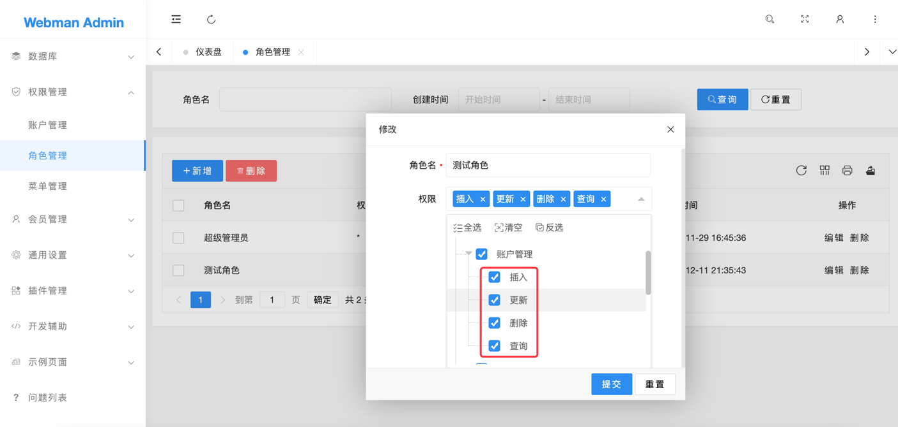

# 鉴权

`webman/admin` 目前只支持管理员鉴权。

## 原理

`wa_rules` 表中存储着菜单和菜单下对应的权限(`控制器@动作`)，例如
```
+----+--------------+----------------------------------------------------+
| id | title        | key                                                |
+----+--------------+----------------------------------------------------+
|  4 | 账户管理     | plugin\admin\app\controller\UserController        |
| 74 | 插入         | plugin\admin\app\controller\UserController@insert |
| 75 | 更新         | plugin\admin\app\controller\UserController@update |
| 76 | 删除         | plugin\admin\app\controller\UserController@delete |
| 77 | 查询         | plugin\admin\app\controller\UserController@select |
+----+--------------+----------------------------------------------------+
```

每个管理员都有一个或多个角色，每个角色在`wa_rules`表里都对应着一系列可访问`控制器@动作`的记录。

例如管理员访问url路径为`/app/admin/user/insert` 时，鉴权中间件会判断当前管理员的角色里是否有`plugin\admin\app\controller\UserController@insert` 的记录，有的话就有权限，否则没有权限。

> **提示**
> 鉴权中间件在`plugin/admin/app/middleware/AccessControl.php`

## 页面内鉴权
有时候我们需要控制页面的某部分例如某个按钮只展现给有权限的管理员查看，这时可以通过给相关页面dom节点增加 permission 属性，例如
```
<div>
    <button permission="app.admin.admin.insert">
        新增
    </button>
    <button permission="app.admin.admin.delete">
        删除
    </button>
</div>
```
permission的值实际上是变种的url路径(`/`用`.`代替)，例如新增按钮需要请求的url路径是`/app/admin/admin/insert`，则`permission="app.admin.admin.insert"`，如果当前管理员在`wa_rules`表里没有`plugin\admin\app\controller\AdminController@insert`对应的记录，则无法看到插入按钮。

## 权限注释
给控制器的方法添加注释，这样能让权限系统自动识别菜单绑定的控制器对应的权限名称，方便在"角色管理"里为角色识别并添加权限。

例如"权限管理"下的"账户管理"菜单绑定的控制器类为`plugin\admin\app\controller\AdminController`，这个类的每个方法的注释如下

```php
<?php
namespace plugin\admin\app\controller;

use plugin\admin\app\controller\Crud;
use support\Request;

class AdminController extends Crud
{
    /**
     * 删除
     */
    public function delete(Request $request){}
    
    /**
     * 查询
     */
    public function select(Request $request){}
    
    /**
     * 添加
     */
    public function insert(Request $request){}
    
    /**
     * 更新
     */
    public function update(Request $request){}

}
```

则在角色管理时就会显示该菜单下的具体权限名称，如图。



假设权限勾选了"账户管理"下的"查询"选项，那么这个角色就有了访问`plugin\admin\app\controller\AdminController`控制器的`select`方法的权限。

## 超级管理员
系统自带一个超级管理员角色，这个角色的权限为`*`，代表着可以访问系统的任何控制器及方法。开发者不要更改或者删除这个角色。

## 登录白名单
有时候某些action不需要登录就可以访问，例如登录验证请求、验证码请求等，这时候我们可以给控制器添加一个`$noNeedLogin`属性，里面填写当前控制器不需要登录就可访问的action名称，例如
```php
<?php
namespace plugin\admin\app\controller;
use plugin\admin\app\controller\Base;

/**
 * 管理员账户
 */
class AccountController extends Base
{
    /**
     * 不需要登录的方法
     * @var string[]
     */
    public $noNeedLogin = ['login', 'captcha'];
}
```

## 鉴权白名单
有时候某些action不需要鉴权(但需要登录)，例如获取当前登录管理员的信息接口，此时可以给控制器添加一个`$noNeedAuth`属性，例如

```php
<?php
namespace plugin\admin\app\controller;
use plugin\admin\app\controller\Base;

/**
 * 管理员账户
 */
class AccountController extends Base
{
   /**
     * 不需要鉴权的方法
     * @var string[]
     */
    public $noNeedAuth = ['info'];
}
```

## 外部系统接入鉴权

请参考[其它系统接入](link.md)